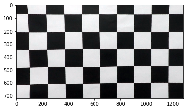
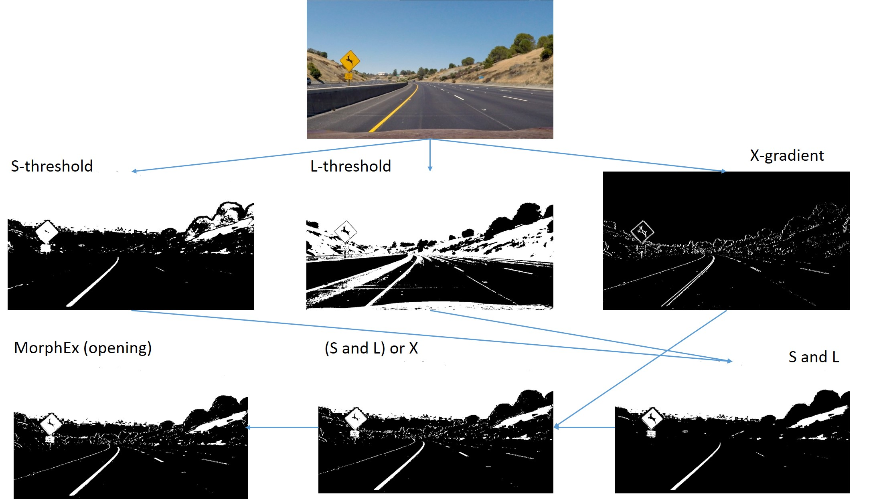
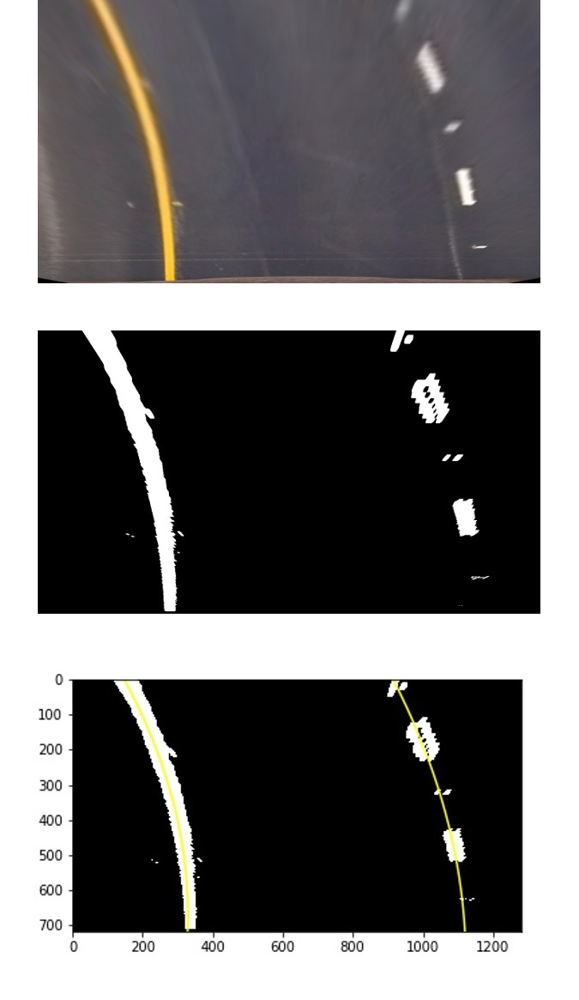

# Advanced Lane Lines Finding Using Unsupervised Learning #


The objective of this project is to detect lane lines in conditions of varying light and shadows, using computer vision techniques to help preprocess the images.
The approach here utilizes the DBSCAN clustering ML algorithm to group together close point in single lane line clusters. 

### Code ###
The code for this project can be found under the 'Advanced Lane Line Finding (using DBSCAN).ipynb' notebook. 
Distortion matrices are calculated and stored via the 'Camera_calibration.ipynb' notebook. Tests and images used to arrive at the optimal parametres for thresholding and warping are in the Scrathc notebook.

### Process Overview ###
- **Calibrate** the camera by reading in chessboard images and locating their corners, to calculate the distortion coefficients
- Use the distortion coefs to undistort any new images before further processing
- Apply thresholding/gradients to get masked image of only the interesting pixels
- **Warp** the images of the road from the car camera to get the bird's eye view of the road
- Downsize the image 10x for the next step to work in real time
- **Use DBSCAN** to search for lane lines' pixels by exploiting adjacency and add to collection
- **Plot the lines using polynomial fit**
- **Scale the poly-line** and apply to the original size warped image
- **Overlap n subsequent images** to get better continuity and perform lane line detection 
- Record line and car position data
- Draw on road and inverse the warp taken before to get highlighted road markings and curvature

### Camera Calibration ###
Using the chessboard images taken with the dashcam, I found corners in the pattern and then computed the transform plus distortion matrix for this camera. These matrices were then saved as a Pickle object for later use.

```
ret, mtx, dist, rvecs, tvecs = cv2.calibrateCamera(objpoints, imgpoints, img_size, None, None)
```

Sample image input and output

 


### Gradient and Color thresholding ###
Next step, after image rectification was to extract gradient and color information from the images. I've used the 'L' and 'S' channels (in logical AND) with gradient in the x-direction (logical OR) to extract as much information as possible about the lane lines. This was followed by an 'Opening' morpjology operation to remove some noise from the images.
The images below demostrate the process.


### Warping and Plotting ###
The processed image is then warped using the below src and dst matrices:

```
src = np.float32([(585,455), (695,455), (1100,720), (180,720)])
dst = np.float32([(240,0), (1040,0), (1040,720), (240,720)])
M = cv2.getPerspectiveTransform(src, dst)
Minv = cv2.getPerspectiveTransform(dst,src)
```

The warped image is put through the DBSCAN algorithm, that considers each point (white pixel) as a data sample its coordinates as features. Points are clustered together based on their proximity, forming 2 main groups, one for each lane line. These clusters are then used to fit a second degree polynomial and lines plotted.

```
# finding point clusters
dbscan = DBSCAN(eps=epsilon, min_samples=min_samples)
nonzeros = np.array(np.nonzero(img), dtype=np.float32).T
y = dbscan.fit_predict(nonzeros)
```



### The video pipeline and output ###
Each image in the video queue is put through the above image processing after distortion correction. Followed by warping and lane line point clustering.
Additionally, the previously found line data is saved for averaging and validation use for next images in the sequence. I also overlap two frames to get more points to search with.
Radius of curvature and offset of the car is written on the image before writing to output video.
The video is in the root folder: "project_video_output.mp4"

### Further discussion & conclusion ###
The pipeline I've implemented can be improved further by adding more noise reduction and lane-lines color amplification.
At this point, the process does hold well against outliers (such as bright spots) and discoloration of roads.

There are many parameters that require manual fine tuning to get the best possible results with makes it a hard and time consuming process.
The process (even if made robust) relies heavily on the presence of lane markings, making the system unable to navigate without it (on dirt roads for instance).

